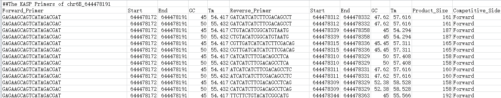

# KASPar_Primer_Deginer

The Perl script is written to automatically design the KASPar (Kompetitive Allele Specific PCR) Primer for SNP. Firstly, a flanking sequence fasta file must be created using the **Exteact\_Flanking\_Seq.pl** script. The flanking length is suggested to be 300 bp. And then, we can obtain the unique KASPar primer using the script. 

Software requirements:

>**Perl;blastn;primer3_core;**

Usage:

>$ perl KASP.PrimerDesign.Improved.pl -h
>
>  Usage:
>  
>  Run by typing: perl KASP.PrimerDesign.Advance.pl -cfg [Parameter config file] -input [Flanking Seq fasta file] -out [Primer output]
>  
    Required params:
        -c|cfg                                                  [s]     Parameter config file
        -i|input                                                [s]     Flanking Seq fasta file
        -o|out                                                  [s]     Primer output
    Example: perl KASP.PrimerDesign.Advance.pl -cfg [Parameter config file] -input [Flanking Seq fasta file] -out [Primer output]

Output:

**Method:**

The KASPar primers consist of a allele-specific forward primer and a common reverse primer. The forward and reverse primers are both designed using the software Primer3. After that, the competitive primers (maybe forward or reverse)   are selected according to the 3' end position. And then, the forward and reverse primers were botn aligned to the reference genome by use of blast+, and only the unique pairs (at least one is unique) were picked in the last. The suggestive parameter for Primer3 and blast can be found in the configure file here.

The factor that were considered:
>1. GC content: 45%-60%  
>2. Tm (melting temperatue): 50-60); Tm difference between forward and reverse primer < 5  
>3. mismatch number < 3  
>4. Primer length: 18-25nt  
>5. Product size (including primer length): 150-200 bp
>6. Unique hits  
>7. No hairpin   
>8. No self-dimer and cross-dimer (no more than 4 consective bases complementary pairing) 